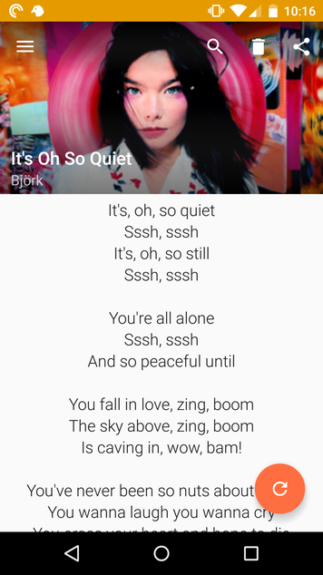
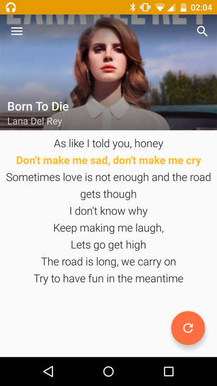
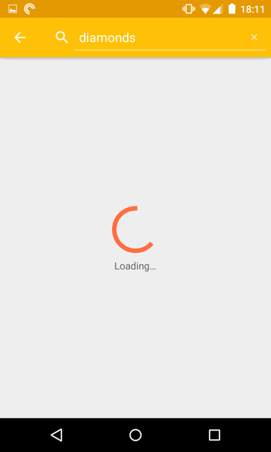
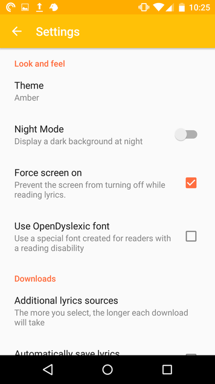

# QuickLyric

QuickLyric is an android app that instantly fetches your lyrics for you. Its main perks is that it's very fast, features Material Design as well as a search engine, a Karaoke mode, the downloading of all your lyrics on your device & some handy settings. While most lyrics app require you to type the name of the song you're searching for or annoy you with tedious notifications every time the song has changed, QuickLyric automatically detects what song is playing on your device and instantly delivers the lyrics to you.

QuickLyric is written in Java and runs on phones and tablets equipped with Android 4.0 or higher.
The build system relies on Gradle and Android Studio is therefore recommended.

## FAQ:

### Can I fork this project, put it on the Google Play Store and put my ads on it? 

Unless you meet all the criteria, the short answer is "No and I will get your fork taken down".

A longer answer is [here](https://github.com/QuickLyric/QuickLyric/wiki/Can-I-fork-this-project,-change-the-name,-put-it-on-Google-Play-and-pretend-it's-mine%3F).

### How can I integrate QuickLyric into my music player?

If you want to add a button that says "show lyrics in QuickLyric" (or something like that) in your app, you can find some instructions in the [Wiki](https://github.com/QuickLyric/QuickLyric/wiki/Integrating-QuickLyric-in-your-app).

## Download

 

or on [the original F-Droid page](https://f-droid.org/repository/browse/?fdid=com.geecko.QuickLyric).

*Note: The F-Droid page is currently not up to date, they still have a build from 2 years ago. The Google Play version contains some teeny tiny portions of code that are not public (monetization, handling copyrighted content, etc.)*

## Features

* **Lyrics** - Shows the lyrics of the song you are listening to at the moment. The Refresh button allows your to update the lyrics when the next song has started playing. In the action bar, you can to download the lyrics on your device (for offline usage), search and share the URL with a friend. If you're lucky, the Karaoke mode might be available for that song.
* **Saved Lyrics** - Each lyrics can be stored on your device.
* **Search** - Search for Lyrics on Genius.
* **Batch Download** - Download the lyrics for all your music in a few minutes.
* **Material Design**
* **System Integration** - Access the lyrics you want after you've identified a song with Shazam or Soundhound via the share button.
* **NFC** - Share lyrics with your friends via Android Beam.
* **More than 15 languages supported** - Including German, Greek, Spanish, French, Italian, Japanese, Dutch, Polish, Russian, Turkish and English.

## Build
* Make sure you have the **latest** version of Gradle installed. You should have at least the version that is used in Quicklyric/build.gradle. There is no gradle wrapper on this repo.
* Download the sources
* **Edit the different API keys in the com.geecko.QuickLyric.Keys file.**
* Input your signature keystore, login and passwords into the QuickLyric/build.gradle file
* cd to the root of the project and execute "$ gradle build"

## Translations

What QuickLyric needs most right now is translations!
If you're bilingual you can submit translations over at [Crowdin](https://crowdin.com/project/quicklyric/invite/public?show_welcome&d=f326bebae52bede2605396991089b9bf380270) (no need to register, just use your GitHub/Google/Facebook/Twitter account). 

**Every translator may request 1 free beer if they stop by Brussels.** ;)

## Open Source Contributors

If you want to expand the lyrics catalog, check out the [wiki](https://github.com/geecko86/QuickLyric/wiki/Expanding-the-catalog).

Don't be afraid to contribute! I welcome all forks & pull requests but *please*, if you want to fork QL, immediately update com.geecko.quicklyric.Keys with your own keys (Spotify, Genius, ..).

## Credits

Credits are listed in the app in the about section

## Screenshots

